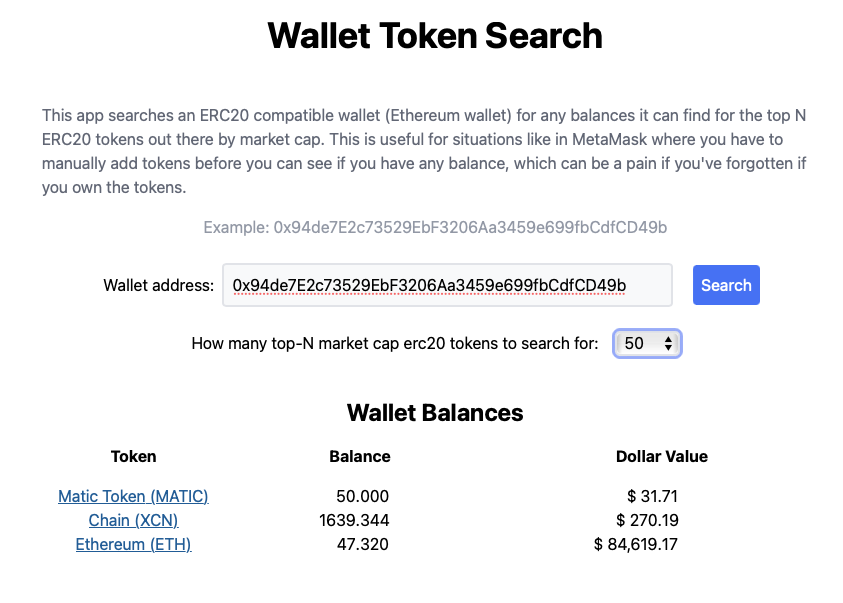

# Crypto Wallet Search

This is a simple crypto app I wrote to solve a minor issue I had when trying to
setup a new metamask wallet in a browser. Metamask will not display token balances
unless you ask it to, but sometimes you've forgotten if you even have any balances
at all for coins you've owned in the past. This is especially common during tax
season where you might need to do a quick audit of a wallet to see what assets
might still be there.

This application is only concerned with Ethereum (erc20) compatible tokens, but
it could very easily be adjusted for any other L1 or L2 chains. Ethereum is just
the most popular.

The app by default searches the top 50 (by market cap) ethereum tokens to see if
any balances exist, only reporting if there are any.

## Getting Started

> npm install

There is an initial build step that generates a fresh `front/tokens.ts`. If that
fails, for some unknown reason (it is dependent upon scraping external sources),
you can simply run `npm run serve` instead of `npm run start` to simply run
based off of the tokens list that is included in the repo.

> npm start

Open your browser to `http://localhost:1234`.

## Underlying Tech

This example uses Infura to get a stable ethereum node to make queries from. The
Ethers.js framework is used to make the query and get balances. The market cap of
the ERC20 coins is gathered from etherscan.io but only at build time due to CORS
issues, and the fact that market cap inclusion is probably not so volatile that
it needs to be dynamically refreshed for the top 200 tokens. The prices are provided
via the CoinGecko api and as such might not have pricing information for every token
but most of them will have it.

## References

-   [Infura.io](https://infura.io)
-   [Ethers.js](https://docs.ethers.io)
-   [Etherscan.io](https://etherscan.io)
-   [CoinGecko](https://www.coingecko.com)
-   [ReactJS](https://reactjs.org)
